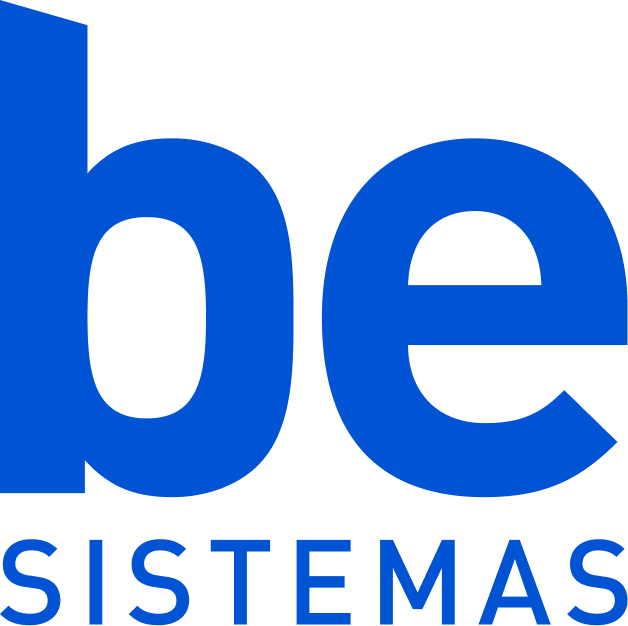

# Desafio Dev. Pleno: Full Stack PHP + REACT 



> O objetivo deste desafio é desenvolver um Gerenciador de Empréstimos de Livros 
simplificado. O sistema permitirá que usuários autenticados visualizem um acervo e 
solicitem o empréstimo de exemplares disponíveis, com controle de estoque e histórico.


>[!NOTE] Importante
> O desafio deve demonstrar maturidade em consistência de dados, concorrência, 
qualidade de API (retornos corretos), SQL, Idempotência (quando usar), e frontend 
com gerenciamento de estado. Esses detalhes devem ser identificados em quais regras e 
casos de uso devem ser implementados.

## 💻 Tecnologias


<!--  -->

## 🚀 Instalando

### Com Dev Container (Recomendado)
- Abra o projeto no VS CodE
- Execute `> Dev Containers: Reopen in Container`.

## Diretamente pelo Docker Compose

- Suba o stack principal (usa .devcontainer como fonte):
```sh
    docker compose -f .devcontainer/docker-compose.yml up -d --build
```

## ▶️ Executando
- Dentro do container, configure o app e o banco:
```sh
    cp .env.example .env
    php artisan key:generate
    composer install
    npm install
    php artisan migrate --seed
```
- Rodar front em modo dev (opcional, com portas já encaminhadas):
```sh
npm run dev -- --host --port 5173
```

- Endpoints úteis: API em http://localhost (Nginx → php:8000); MySQL host `mysql` porta `3306` (user/pw `mysql`); Vite em http://localhost:5173.
- Encerrar tudo:

```sh
docker compose -f .devcontainer/docker-compose.yml down -v
```

## TODO do desafio

- [x] Ambiente: subir via docker compose padrão.
- [ ] Autenticação com Laravel Breeze e rotas protegidas (backend e frontend).
- [ ] Modelagem: livros e empréstimos (com relacionamentos coerentes) com seeder >= 10 livros.
- [ ] CRUD: Livros e Empréstimos
- [ ] Validação: Estoque consistente mesmo com acessos simultâneos.
- [ ] Validação: Limite de três empréstimos ativos por pessoa
- [ ] Regra: devolução de empréstimos
- [ ] Regra: marcação de atraso após 7 dias.
- [ ] Frontend: SPA responsiva com gerenciamento de cache/estado
- [ ] Frontend: UX clara sobre disponibilidade e feedback das operações.
- [ ] Tela de livros com listagem usando MUI Table.
- [ ] Teste: e2e da listagem de livros.
- [ ] SQL obrigatório: tela Meus empréstimos exibidos com consulta SQL direta juntando livros + empréstimos.
- [ ] Arquitetura: usar Actions como diferencial.
- [ ] API: respostas corretas, validações claras, paginação onde couber e tratamento explícito de erros de domínio.
- [ ] Guia de uso/testes: instruções de setup e passos de execução/testes prontos para rodar com comandos explícitos.
